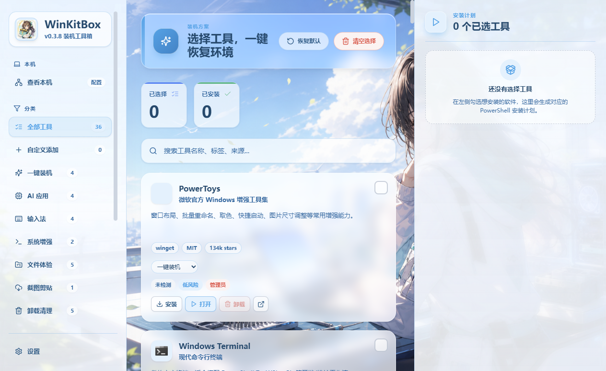

# WinKitBox


WinKitBox 是一个面向 Windows 的装机和环境恢复工具箱。它把常用软件目录、安装计划、本机环境体检、GitHub 开源发现、AI 辅助添加工具和操作历史放在一个桌面应用里，目标是让换电脑、重装系统、维护工具集这件事更可控。

> 封面图是项目视觉图；真实界面见下方截图。



## 适合谁

- 经常重装系统、换电脑、维护多台 Windows 设备的人。
- 想把常用软件、便携工具、自定义脚本长期整理成一个工具箱的人。
- 想用 AI 辅助生成 GitHub 开源工具安装配置，但又不想让 AI 直接写任意脚本的人。
- 需要快速查看本机硬件、网络、DNS、UTF-8、运行库等状态的人。

## 核心能力

### 工具目录和一键恢复

- 内置常见 Windows 工具，覆盖系统增强、AI 应用、输入法、文件体验、截图剪贴、卸载清理、桌面整理、网络同步等分类。
- 支持 `winget`、GitHub Release、直链安装包、ZIP 便携包、本地 exe/msi/zip、快捷方式和自定义命令。
- 勾选工具后自动生成 PowerShell 安装计划，支持单个安装、批量安装、单个卸载、批量卸载。
- 便携工具会放进可配置的 WinKitBox 工具目录，避免散落在下载目录。

### 自定义添加

- 支持本地 exe、msi、zip、lnk、bat、cmd、ps1。
- 默认是“选择文件 -> 预览处理方案 -> 添加到工具箱”的轻流程。
- 复杂场景可以展开高级设置，手动指定 ZIP 内启动程序、启动命令、卸载命令或 winget ID。
- 自定义工具、分类和分类覆盖会长期保存在本机设置里，更新应用不会丢。

### AI 辅助

- 复用设置中的 OpenAI 兼容 API URL、API Key 和模型名称。
- 输入 GitHub 仓库地址后，AI 会结合仓库和 Release 信息生成工具定义。
- GitHub 榜单下的 AI 助手可以按需求推荐多个 Windows 友好的开源项目。
- 安装失败后可以一键让 AI 基于工具定义和最近失败上下文修复配置。
- AI 输出不会直接变成任意 PowerShell；工具定义会经过结构化校验。

### 工具更新中心

- 检测和更新分离：检测只读取本机版本和来源最新版本，真正更新只在用户点击更新后执行。
- winget 工具使用只读版本查询，避免“检测更新”误触发升级。
- GitHub Release、便携包、本地包等无法稳定读取当前版本的工具，会明确显示“可重装刷新”或“无法判断”。

### 日志与操作历史

- 设置页保留实时日志，用于查看当前会话里的操作输出。
- 新增持久化操作历史，保存最近 200 条安装、卸载、更新、检测、打开、AI、配置操作。
- 历史记录包含状态、时间、工具、来源、退出码和摘要。
- 最近失败会被 AI 修复流程复用，减少用户手动复制错误信息。
- 操作历史单独保存，不会塞进导入导出的轻量配置文件。

### Windows 环境体检

- 查看系统版本、CPU、内存、硬盘、显卡、网卡等本机信息。
- 检查 winget、Windows PowerShell、.NET Desktop Runtime、VC++ 运行库、Windows 长路径、UTF-8 Beta。
- 支持一键开启或关闭 Windows UTF-8 Beta。
- 支持查看和修改网卡 IP、网关、DNS，内置公共 DNS 推荐和延迟测试。

### GitHub 发现

- 浏览 Windows 相关 GitHub 周榜/月榜。
- 支持语言筛选、关键词搜索、中文简介翻译、代理设置和 GitHub Token。
- 项目可以直接打开 GitHub、复制链接，或通过 AI 添加到工具箱。

## 操作流程

```text
选择工具 / 添加自定义工具
        |
        v
生成安装、卸载或更新计划
        |
        v
用户确认后执行 PowerShell
        |
        v
刷新安装状态和打开入口
        |
        v
写入操作历史，失败时可交给 AI 修复
```

## 本地开发

```powershell
npm install
npm run dev
```

如果 `npm` 能找到，但子进程找不到 `node`，可以临时把 Node 加到 PATH：

```powershell
$env:Path='C:\Program Files\nodejs;'+$env:Path; npm test
```

## 验证

```powershell
npm test
npm run build
```

## 打包 Windows 版本

```powershell
npm run package:win
```

产物位于 `release/`：

- `WinKitBox-<version>-Setup-x64.exe`
- `WinKitBox-<version>-Portable-x64.exe`

## 项目结构

```text
src/App.tsx              主界面、工具目录、本机页、设置页、操作历史 UI
src/DiscoverView.tsx     GitHub 榜单和 AI 推荐
src/core/                目录数据、安装计划、AI 工具、网络、更新、日志模型
electron/main.cjs        Electron 主进程、IPC、PowerShell、设置和历史存储
electron/preload.cjs     Renderer 安全桥接
assets/backgrounds/      内置背景主题
assets/icon/             应用图标
assets/readme/           README 图片素材
scripts/package-win.cjs  Windows 打包脚本
```

## 安全边界

- 不要提交 GitHub Token、AI API Key、证书密码、PFX 文件或私有下载链接。
- AI 添加工具只接受受控的安装形态，不允许直接注入任意 PowerShell。
- 网络请求主要由用户动作触发；代理配置会影响 GitHub、翻译、更新检查和下载。
- `certs/`、`release/`、`artifacts/`、`node_modules/` 等生成或本地敏感内容不应提交。

## Release

应用内更新检查读取：

```text
https://api.github.com/repos/575674384-stack/winkitbox/releases/latest
```

发布时请确保 GitHub Release tag 与 `package.json` 版本一致，例如 `v0.3.12`。
